# User Manual

A 2D Metroidvania-style platformer built in Python with the Arcade
library. You explore a linked series of caves, fight enemies for coins,
buy upgrades that unlock new movement abilities, find hidden treasure
rooms, and finally face the Cave Guardian boss.

---

## Contents

1. [Installation](#1-installation)
2. [Starting the game](#2-starting-the-game)
3. [Controls](#3-controls)
4. [The screen explained](#4-the-screen-explained)
5. [How to play](#5-how-to-play)
   - [Moving around](#51-moving-around)
   - [Fighting enemies](#52-fighting-enemies)
   - [Travelling between areas](#53-travelling-between-areas)
   - [The shop](#54-the-shop)
   - [Breakable walls](#55-breakable-walls)
   - [Treasure chests](#56-treasure-chests)
   - [Hazards](#57-hazards)
   - [The boss fight](#58-the-boss-fight)
6. [Pausing and quitting](#6-pausing-and-quitting)
7. [Map of the world](#7-map-of-the-world)
8. [Troubleshooting](#8-troubleshooting)

---

## 1. Installation

**Step 1 — Install Python.**
Download Python 3.9 or newer from [python.org](https://www.python.org/downloads/)
and install it. On Windows, tick **"Add Python to PATH"** during setup.

Check it worked by opening a terminal (Command Prompt on Windows,
Terminal on macOS) and typing:

```
python --version
```

**Step 2 — Download the game.**
Download or clone the project folder to your computer.

**Step 3 — Install the game's one dependency.**
In the terminal, move into the project folder and run:

```
pip install -r requirements.txt
```

This installs the Arcade library (version 3.3.3), which the game is built on.

**Step 4 — Run the game.**

```
python main.py
```

You do not need to be inside the project folder for the game to work —
all artwork and map files are located relative to the program itself.

---

## 2. Starting the game

When the game opens you see the main menu.

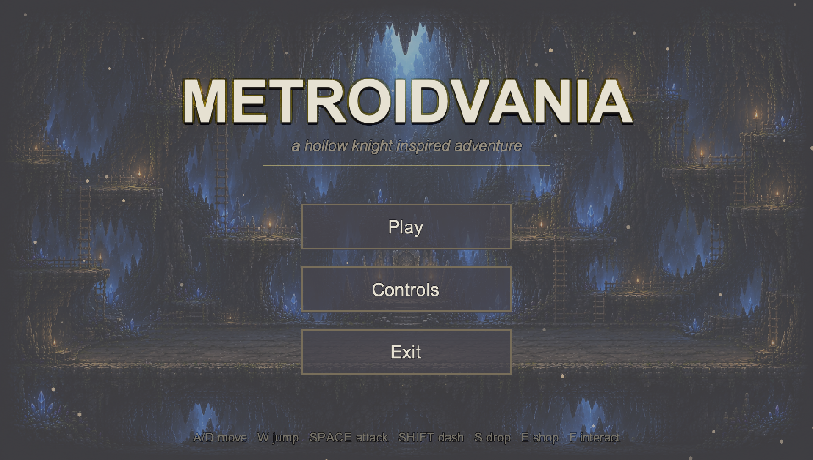

- **Play** — starts a new game
- **Controls** — shows the full list of controls and gameplay tips
- **Exit** — closes the game

The Controls screen can be read before you start playing:

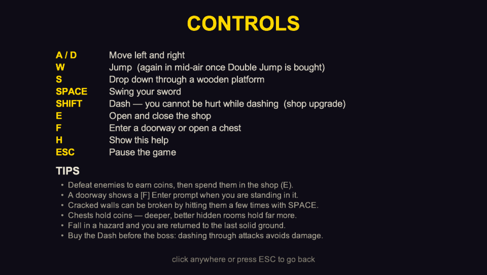

The first time you begin a game, the same help is shown automatically so
you always know the controls. Press **H** or **Esc** to dismiss it, and
press **H** at any time during play to bring it back.

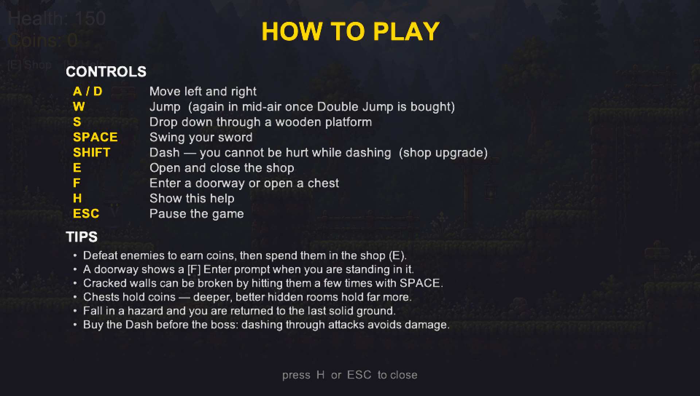

---

## 3. Controls

| Key | Action |
|---|---|
| **A** / **D** | Move left and right |
| **W** | Jump (press again in mid-air once you own Double Jump) |
| **W** *(against a wall, in mid-air)* | Wall jump (once you own Wall Jump) |
| **S** | Drop down through a wooden platform |
| **Space** | Swing your sword |
| **Shift** | Dash (once you own Dash) — you cannot be hurt while dashing |
| **E** | Open and close the shop |
| **F** | Enter a doorway, or open a chest |
| **H** | Show or hide the help screen |
| **Esc** | Pause the game |

---

## 4. The screen explained

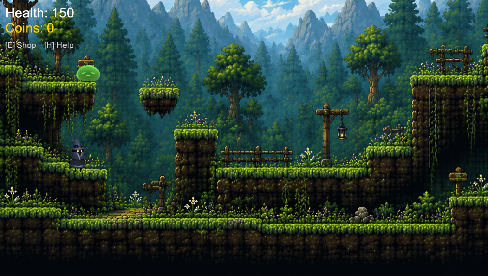

| Display | Meaning |
|---|---|
| **Health** (top left) | How much damage you can still take. At 0 you are defeated. It starts at 150 |
| **Coins** (top left, gold) | Your money, used in the shop. Earned from defeating enemies and opening chests |
| **[E] Shop [H] Help** | A permanent reminder of the two menu keys |
| **Prompt above your head** | Appears when you are standing somewhere you can interact — for example `[F] Enter` in a doorway |

---

## 5. How to play

### 5.1 Moving around

Walk with **A** and **D**, and jump with **W**.

Wooden platforms are one-way: you can jump up *through* them from below
and land on top. To drop back down through one, press **S**.

If the ground rises by a single tile, you walk up it automatically — you
only need to jump for bigger climbs.

### 5.2 Fighting enemies

Green slimes chase you. Touching one costs health and knocks you backwards.

Press **Space** to swing your sword. A white slash appears in front of
you and any enemy caught in it flashes red and takes damage. Defeating an
enemy earns you **10 coins**.

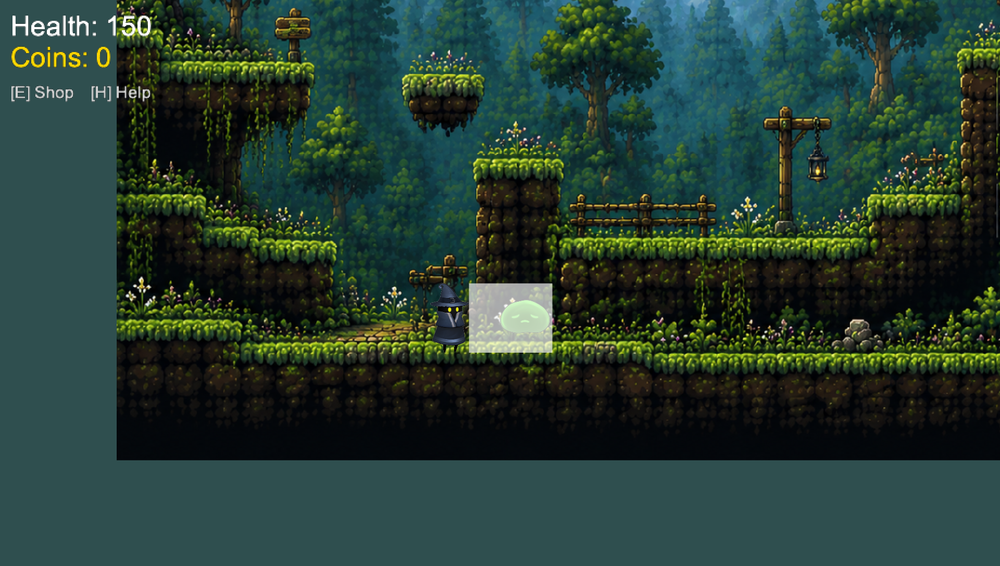

Once you own the **Dash** (Shift), you are completely invincible for the
short burst of the dash — dashing through an enemy or an attack takes no
damage at all.

### 5.3 Travelling between areas

Doorways connect the areas of the world. Stand in one and a prompt
appears above your head; press **F** to travel through it.

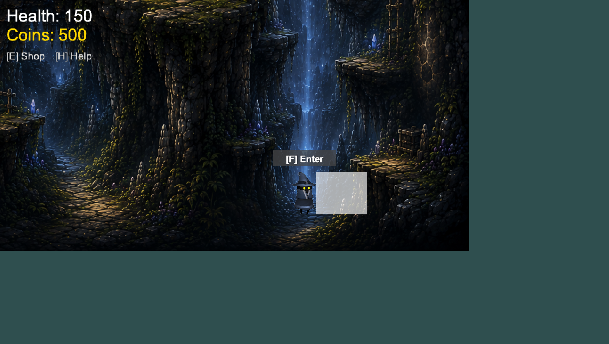

Doors never activate just because you touched them, so falling onto one
can never drag you somewhere by accident.

### 5.4 The shop

Press **E** to open the shop, and **E** or **Esc** to close it. The game
pauses while it is open. Press the number key beside an item to buy it.

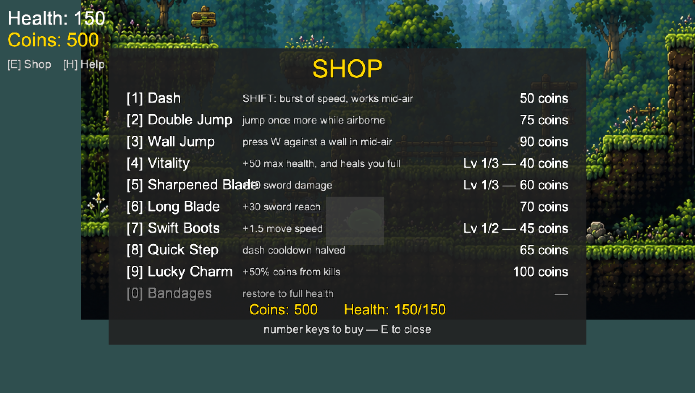

| Key | Item | Price | Effect |
|---|---|---|---|
| 1 | Dash | 50 | Shift dashes forward; you are invincible during it |
| 2 | Double Jump | 75 | A second jump while in mid-air |
| 3 | Wall Jump | 90 | Press W against a wall in mid-air to jump again |
| 4 | Vitality | 40 / 80 / 120 | +50 maximum health each level (3 levels), and heals you fully |
| 5 | Sharpened Blade | 60 / 110 / 160 | +10 sword damage each level (3 levels) |
| 6 | Long Blade | 70 | +30 sword reach |
| 7 | Swift Boots | 45 / 90 | +1.5 movement speed each level (2 levels) |
| 8 | Quick Step | 65 | Halves the dash cooldown |
| 9 | Lucky Charm | 100 | +50% coins from every kill |
| 0 | Bandages | 25 | Restores you to full health (buy as often as you like) |

Items you already own are marked **OWNED** in green. Items you cannot yet
afford are greyed out. Upgrades with several levels show your progress,
for example `Lv 2/3`.

### 5.5 Breakable walls

Some walls are cracked and can be destroyed. Stand next to one and hit it
with **Space** a few times — it flashes white with each hit and then
collapses, opening a passage to a hidden area.

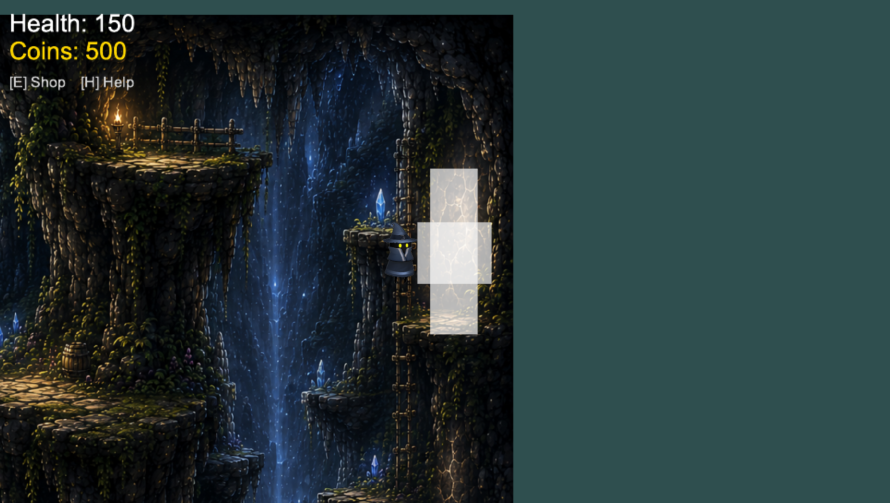

Once broken, a wall stays broken for the rest of your session.

### 5.6 Treasure chests

Hidden rooms contain a treasure chest. Stand next to it, press **F**, and
the coins float up as they are added to your total.

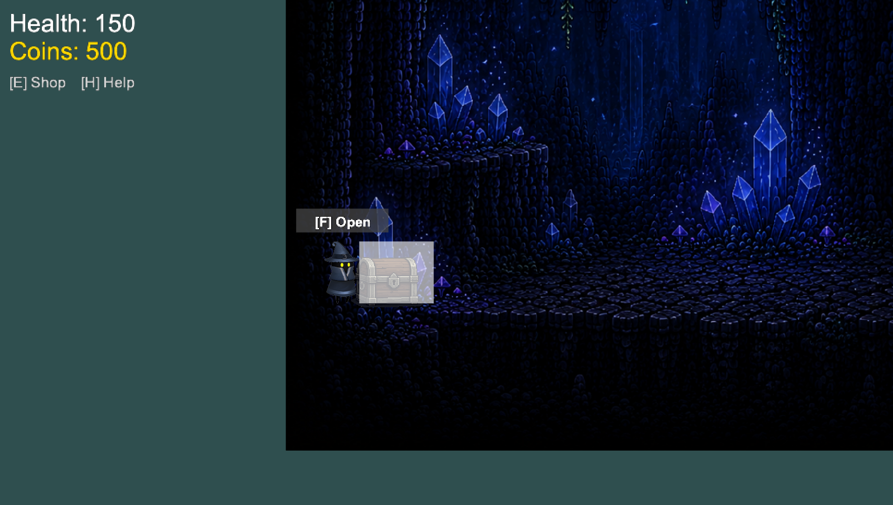
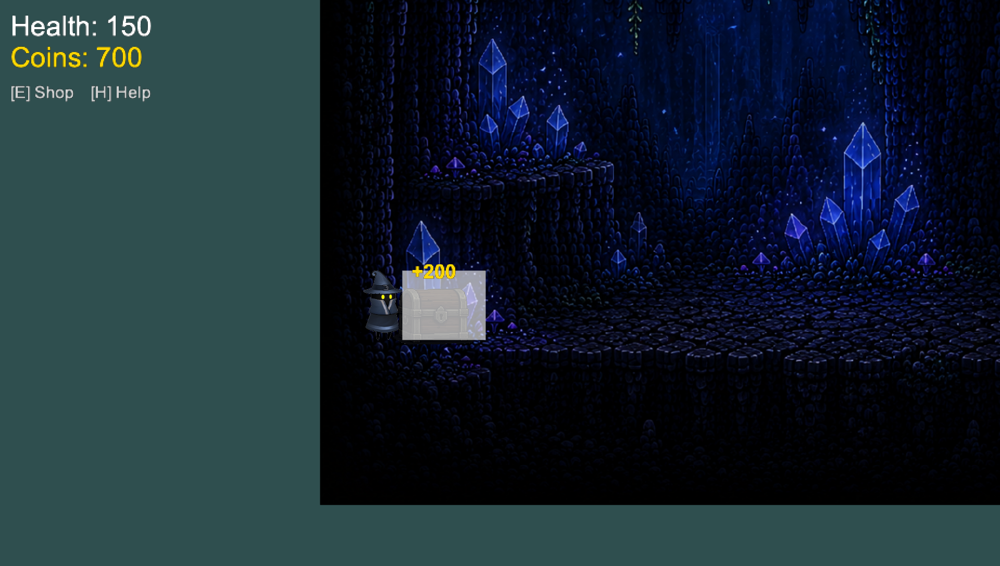

The better hidden the room, the bigger the reward: the easy-to-find room
holds 50 coins, the room behind the breakable wall holds 100, and the
room deep in the Crystal Caverns holds 200. Each chest can only be opened
once.

### 5.7 Hazards

Some areas have hazards such as the spike pit in the Lower Caverns. Fall
into one and the screen fades to black and returns you to the last solid
ground you were standing on.

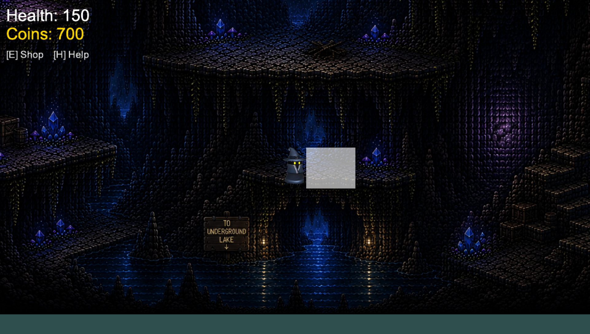

### 5.8 The boss fight

A doorway in the Vertical Shaft leads to the Cave Guardian's arena. Your
health, coins and upgrades all come with you.

The boss fights in **three phases** that get harder as its health bar
(along the bottom of the screen) empties. It always **flashes a colour to
warn you** before it attacks, and the colour tells you what is coming:

| Warning colour | Attack | How to avoid it |
|---|---|---|
| Red | Charge — a fast dash across the arena | Jump over it, or dodge to the side. If it hits a wall it is stunned for twice as long — your best chance to attack |
| Purple | Leap and slam — landing sends shockwaves along the ground | Jump over the shockwaves |
| Green | Spit — a fan of arcing projectiles | Move out of the arc or dash through it |
| Blue | Rain — hazards fall from the ceiling | Move into the gaps between them |
| Orange | Beams *(phase 3 only)* — laser beams across part of the arena | Warning lines blink first; move out of their path before they fire |

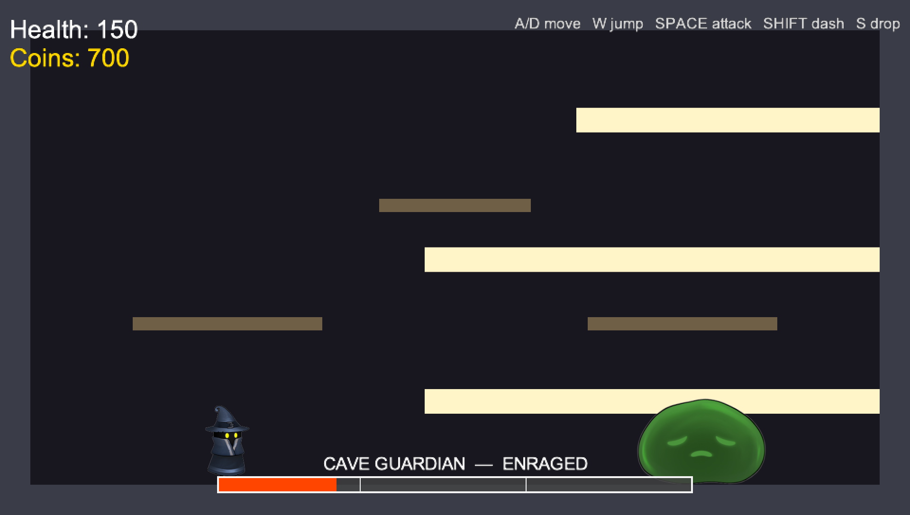

Each time the boss drops into a new phase it is **staggered**: it blinks
gold, stops moving, and cannot fight back. This is your free hit window.

Beat it and you earn **150 coins**.

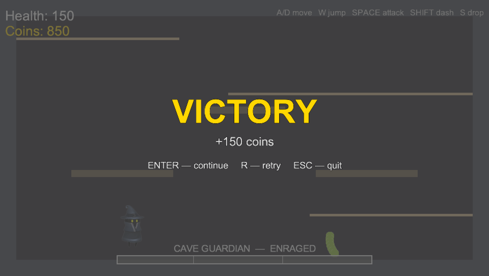

If you are defeated, press **R** to try again straight away, or **Enter**
to return to the caves and prepare.

---

## 6. Pausing and quitting

Press **Esc** at any time to pause. The game freezes completely.

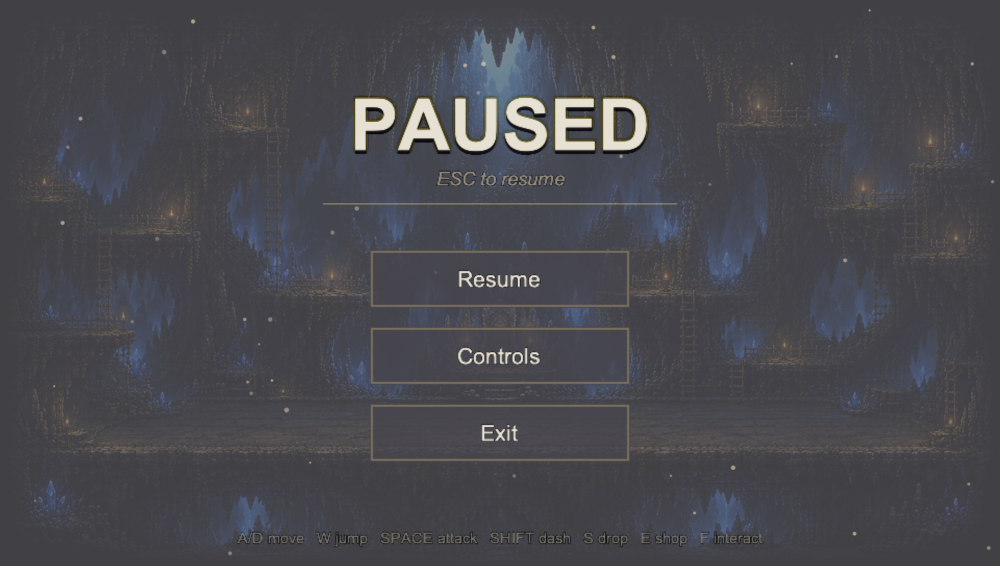

- **Resume** (or **Esc** again) — return to exactly where you were
- **Controls** — read the controls
- **Exit** — close the game

---

## 7. Map of the world

```
                       Surface
                          |
                    Starting Cave  ──────────  Starter Loot Room (50 coins)
                     /    |     \
                    /     |      \___ Secret Loot Room 1 (100 coins)
                   /      |               [behind the breakable wall]
                  /       |
        Vertical Shaft ── Lower Caverns ── Underground Lake
          /    |    \                        [spike hazards]
         /     |     \
  Crystal    BOSS    (Parkour room —
  Caverns    ARENA    coming soon)
     |
  Secret Loot Room 2 (200 coins)
```

---

## 8. Troubleshooting

**"python: command not found" or "'python' is not recognised"**
Python is not installed, or was not added to your PATH. Reinstall it from
python.org and tick "Add Python to PATH". On macOS, try `python3` instead
of `python`.

**"ModuleNotFoundError: No module named 'arcade'"**
The Arcade library is not installed. Run `pip install -r requirements.txt`
from the project folder. If `pip` is not recognised, try
`python -m pip install -r requirements.txt`.

**The window opens and immediately closes**
Run the game from a terminal rather than by double-clicking, so you can
read the error message. The most common cause is a missing dependency
(see above).

**"FileNotFoundError" mentioning an Assets or Maps file**
Part of the project folder is missing. Make sure you have the whole
folder, including the `Assets` and `Maps` sub-folders.

**The game runs slowly**
Close other programs. Room loading is the heaviest moment because each
room slices about 6,000 tile textures; a short pause when moving between
areas is normal.

**I fell through the floor / I am stuck**
Press **Esc** and choose Resume, or walk into a doorway and press **F**
to reload the area. If you fall into a hazard the game returns you to
solid ground automatically.

**I cannot open a door**
Doors need the **F** key — standing in one is not enough. If no `[F] Enter`
prompt appears, that doorway leads to an area that has not been built yet.

**I bought Dash but Shift does nothing**
The dash has a short cooldown between uses, and in mid-air you may only
dash once until you land. Buy **Quick Step** to halve the cooldown.
